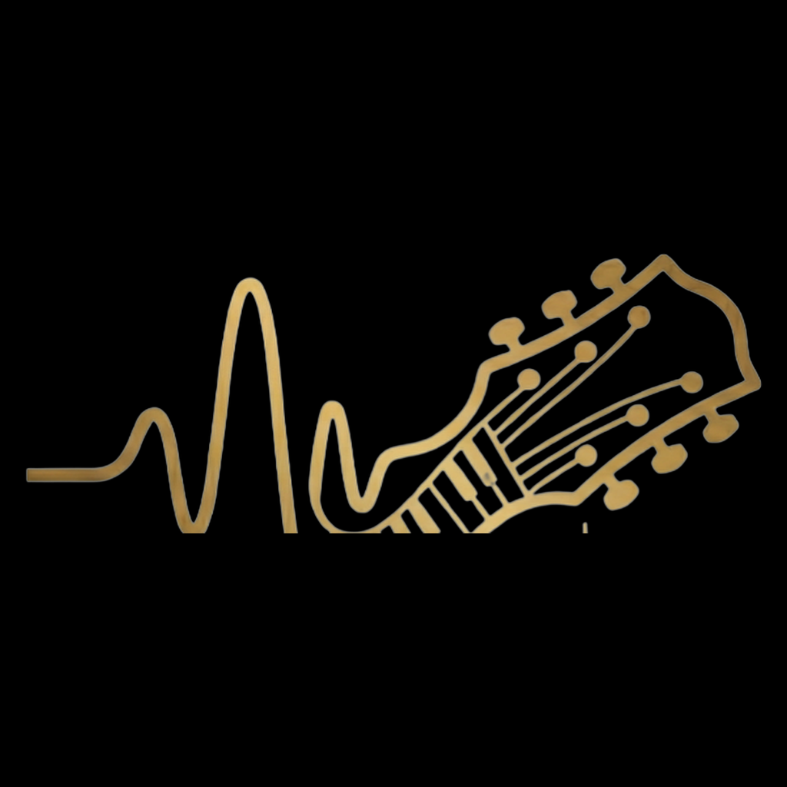

<p align="center">
  
</p>

<h1 align="center">Unweave</h1>

<p align="center">
  <strong>Visualize the layers. Isolate the sound. Produce without limits.</strong>
</p>

<p align="center">
  <a href="#-quick-start"></a>
  <a href="LICENSE"></a>
  <a href="#-hardware-acceleration"></a>
  <a href="#-native-desktop-app--dmg"></a>
</p>

<p align="center">
  Upload any audio track and isolate <strong>Vocals, Drums, Bass, Guitar, Piano & Other</strong>.<br/>
  Full-featured standalone DAW workspace with Multi-Track Timeline, Studio Mixer Console, 360° 8D Spatial Audio Mixer, and Master Mixdown Export.
</p>

---

## ✨ Major Features

### 🧠 6-Stem AI Separation Engine & Quality Presets
- 🧬 **6-Stem AI Separation** — Powered by `htdemucs_6s` (Hybrid Transformer Demucs) for studio-grade isolation of Vocals, Drums, Bass, Guitar, Piano, and Other.
- 🎚️ **Separation Quality Presets** —
  - **Good Quality** *(Recommended)*: Standard studio separation with clean stem isolation and balanced fidelity.
  - **Better Quality** *(High Detail)*: Enhanced multi-shift averaging, sharper frequency definition, and reduced vocal bleed.
  - **Best Quality** *(Studio Master)*: Maximum deep-learning shift averaging with pristine vocal clarity and zero phase artifacts.
- 🛡️ **Memory-Curtailed Sequential Queue** — Single-worker execution pipeline processes multi-song batches sequentially with model caching to prevent RAM thrashing and OS freezes.
- 💾 **Persistent Source & Stem Caching** — Audio files and stems are cached directly in persistent IndexedDB storage, eliminating re-upload prompts on browser reload.
- ⚡ **Multi-Hardware Acceleration** — Instant acceleration on Apple Silicon (MPS), NVIDIA (CUDA), AMD (DirectML/ROCm), or CPU fallback.

### ⏱️ Multi-Track DAW Timeline Editor
- 🎹 **Multi-Track Audio Sequencing** — Add, arrange, trim, and split audio clips across independent color-coded tracks.
- 📌 **Persistent Track Headers** — Track titles, solo/mute buttons, and color badges stay permanently visible while scrolling horizontally across complex arrangements.
- 🧲 **Magnetic Snapping Grid** — Configurable snap intervals (`0.1s`, `0.5s`, `1.0s`, or `Free/Off`) for seamless clip positioning.
- ✂️ **Precision Audio Editing** — Clip trimming handles, playhead splitting, gain adjustment, and single-stem routing directly into timeline tracks.
- 📍 **Smart Playhead Auto-Follow** — Viewport smoothly tracks playback across long sessions without interfering with manual scrolling.

### 🎚️ Studio Mixer Console
- 🎛️ **Ergonomic Channel Strips** — Dedicated strips for Bass, Drums, Vocals, Guitar, Piano, and Other with high-visibility stem color badges.
- 🎚️ **Calibrated Decibel Faders** — Logarithmically calibrated volume sliders aligning precisely with standard studio decibel scales (`+3.5 dB` to `-\infty dB`).
- 📊 **60fps Real-Time Stereo VU Meters** — Live dynamic peak and RMS level metering powered by the Web Audio API.
- 🎛️ **3-Band Parametric EQ & Pan** — Independent High (10kHz), Mid (1kHz), Low (80Hz) gain controls ($\pm 12\text{ dB}$) and stereo balance.
- 🔇 **Mutually Exclusive Mute & Solo** — Smart soloing and muting workflows with master peak limiter protection.

### 🌐 360° 8D Binaural Spatial Audio Mixer & Visualizer
- 🎧 **Binaural Spatial Orbiting** — Transform isolated stems into an immersive 8D surround soundfield using real-time HRTF pan and delay modeling.
- 🛰️ **360° Radar Canvas Visualizer** — Interactive radar map with all 4 quadrants (Front-Left, Front-Right, Back-Left, Back-Right) and glowing audio nodes.
- ☁️ **Dynamic Trailing Clouds** — Nodes cast smooth trailing streamer clouds while in motion that smoothly collapse into glowing aura blobs when paused.
- 🖐️ **Direct Drag-to-Adjust Interaction** — Click and drag any stem node in the visualizer to dynamically set its orbital radius, with auto-lock to centered mono.
- 🎛️ **AI Auto vs. Manual Studio Modes** — Toggle between algorithmic spatialization (centered bass/drums, wide instruments, dynamic vocals) and complete manual control over speed, distance, intensity, and cross-ear spill.

### 🚀 Studio Export Hub
- 💾 **Multi-Format Export** — Studio-quality Lossless WAV (16/24/32-bit PCM) or High-Bitrate MP3 (128/192/256/320 kbps).
- 🎚️ **Custom Stem Mixdowns** — Selectively toggle which active tracks to include in the rendered master file.
- 📦 **Bulk ZIP Packaging** — Export all individual isolated stems in a clean `.zip` archive.
- 🔁 **Loop Region Render** — Export specific timeline loop bounds or complete master arrangements.

---

## 🏗️ Architecture

```
┌────────────────────────────────────────────────────────────────────────┐
│                              User Interface                            │
│                  (Web Browser  •  Native macOS App)                    │
└───────────────────────────────────┬────────────────────────────────────┘
                                    │ HTTP (port 8010 / 5180)
┌───────────────────────────────────▼────────────────────────────────────┐
│                       Frontend (React 19 + Vite)                       │
│  • DAW Timeline Engine (Multi-clip, Snapping, Splitting, Auto-follow) │
│  • Studio Live Mixer (Web Audio API, 60fps VU Meters, 3-Band EQ)       │
│  • 360° 8D Spatial Audio Mixer & Interactive Orbit Radar Canvas       │
│  • Media Pool & Persistent Storage (IndexedDB + Storage Layer)         │
│  • Lossless WAV PCM Encoder & MP3 Export Pipeline                     │
└───────────────────────────────────┬────────────────────────────────────┘
                                    │ REST API / Subprocess IPC
┌───────────────────────────────────▼────────────────────────────────────┐
│                         Backend (FastAPI + Python)                     │
│  • Hardware Acceleration Detection (Apple Silicon MPS / CUDA / CPU)    │
│  • Serial Execution Queue (Memory-safe Demucs Model Caching)           │
│  • Hybrid Transformer Demucs (htdemucs_6s 6-Stem Isolation Engine)    │
│  • Subprocess Worker with Multi-Pass Shifts & Live Tqdm Parsing        │
└────────────────────────────────────────────────────────────────────────┘
```

| Component | Technologies |
|-----------|--------------|
| **Frontend** | React 19, Vite 7, TypeScript, Tailwind CSS, Web Audio API, Canvas 2D, Lucide Icons, JSZip |
| **Backend** | Python 3.11, FastAPI, PyTorch, Demucs (`htdemucs_6s`), FFmpeg, Uvicorn |
| **Desktop** | Electron, Native macOS App Bundle, Ad-Hoc Signed DMG |

---

## ⚡ Hardware Acceleration

| Device / GPU | Backend | Supported OS | Processing Speed |
|--------------|---------|--------------|------------------|
| Apple Silicon (MPS) | `mps` | macOS | ⚡⚡⚡ (Fastest on Mac) |
| NVIDIA (CUDA) | `cuda` | Windows, Linux | ⚡⚡⚡ (Ultra Fast) |
| AMD (DirectML / ROCm) | `directml` / `rocm` | Windows, Linux | ⚡⚡ (Fast) |
| CPU Fallback | `cpu` | All platforms | 🐢 (Reliable) |

---

## 🚀 Quick Start

### 1. Web Application

1. **Backend:**
   ```bash
   cd backend
   python3 -m venv .venv
   source .venv/bin/activate   # On Windows: .venv\Scripts\activate
   pip install -r requirements.txt
   python -m uvicorn main:app --reload --port 8010
   ```

2. **Frontend:**
   ```bash
   cd frontend
   npm install
   npm run dev
   ```

- 🎨 **UI:** `http://localhost:5180` (or `http://localhost:5173`)
- 🔧 **API:** `http://localhost:8010`
- 💚 **Health Check:** `http://localhost:8010/api/health`

---

## 📦 Native Desktop App & DMG

Build the standalone macOS App bundle and custom `.dmg` installer with embedded Python AI runtime:

```bash
npm run desktop:dmg
```

Output:
- `dist-desktop/Unweave.app`
- `dist-desktop/Unweave.dmg`

---

## 📄 License

Distributed under the MIT License. See [LICENSE](LICENSE) for more details.
